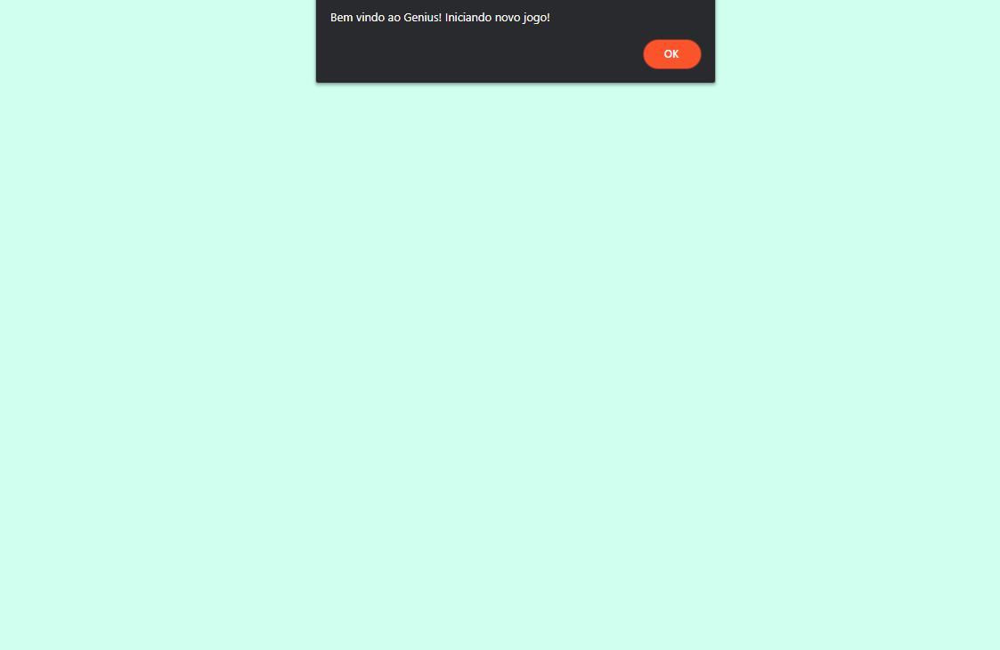
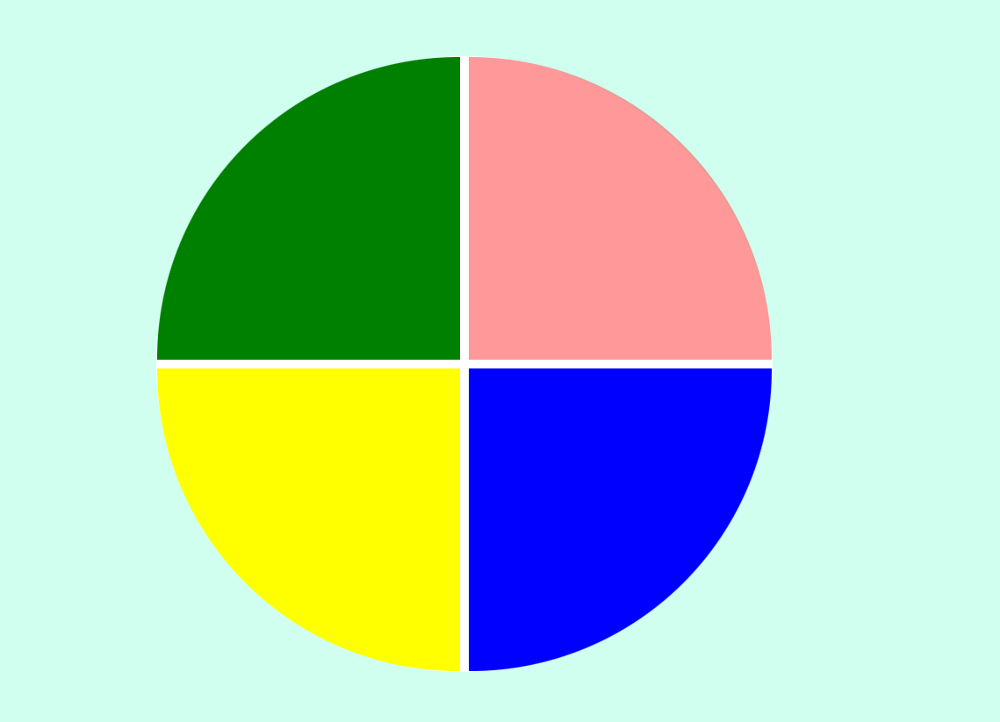

# Genius

Projeto simples para praticar lógica de Javascript realizado no bootcamp DIO - Eduzz Fullstack Developer

## 🧰 Techs
- HTML
- CSS
- JavaScript

## Screenshots

## 👨‍💻 Author

  </img>

Made by Tiago Motta

Contact me:

